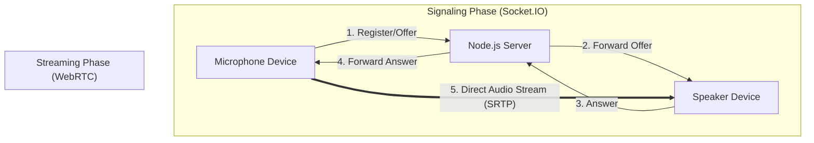

# 🎤 Karaoke Live - P2P Audio Streamer

A high-performance, low-latency peer-to-peer audio streaming application. Turn any device (phone, tablet, laptop) into a microphone and stream audio directly to another device (connected to speakers/TV) over WiFi.


## ✨ Features

- 🎙️ **Ultra-Low Latency**: Direct P2P WebRTC connection with configurable packet sizes (down to 10ms).
- 👥 **Multi-Mic Support**: Connect multiple phones as microphones to a single speaker for group karaoke.
- 📱 **Fully Responsive**: Optimized UI for Mobile, Tablet, Desktop, and **TV** interfaces.
- 🎛️ **Advanced Audio Control**:
  - **Sample Rate**: Dynamic selection based on device capabilities (up to 96kHz).
  - **Packet Size**: Adjustable ptime (10ms, 20ms, 40ms) to balance latency vs. bandwidth.
  - **Processing**: Toggleable Echo Cancellation, Noise Suppression, and Auto Gain Control.
- 🎵 **Audio Effects**: Optional toggleable **Reverb/Echo** effect for karaoke vibes.
- 📊 **Real-Time Monitoring**: Live latency stats for each connected microphone.
- 🔒 **Room System**: Private rooms with unique IDs for isolated sessions.
- 🔗 **Easy Connection**: QR Code generation for instant mobile pairing.
- 🛠️ **Smart Autoplay**: "Silent Audio" unlock mechanism to bypass browser autoplay restrictions.

## 🏗️ Architecture

The application uses a **Signaling Server** (Node.js) only to establish the connection. Once connected, audio flows directly between devices.



## 🚀 Getting Started

### Prerequisites
- Node.js (v14 or higher)
- SSL Certificates (Required for microphone access on non-localhost devices)

### Installation

1. Clone the repository:
   ```bash
   git clone https://github.com/yourusername/micToBtSpeaker.git
   cd micToBtSpeaker
   ```

2. Install dependencies:
   ```bash
   npm install
   ```

3. **Important: SSL Setup**
   Browsers block microphone access on non-secure (HTTP) connections unless it's `localhost`. To use this on your phone/network, you need HTTPS.
   
   Generate self-signed certificates:
   ```bash
   openssl req -nodes -new -x509 -keyout key.pem -out cert.pem
   ```

4. Start the server:
   ```bash
   npm start
   ```

5. Access the app:
   - **On your computer (Speaker):** `https://localhost:3000`
   - **On your phone (Mic):** `https://<YOUR_COMPUTER_IP>:3000`
   *(Note: You will see a security warning because of the self-signed cert. Click "Advanced" -> "Proceed" to continue.)*

## 📱 Usage Guide

1. **Open the App**: Navigate to the home page.
2. **Create a Room**: Enter a Room ID or generate a new one.
3. **Join as Listener (Speaker)**:
   - Click "Listener Mode".
   - Connect your device to Bluetooth speakers or a TV.
   - A QR code will appear.
4. **Join as Singer (Mic)**:
   - Scan the QR code with your phone OR navigate to the URL manually.
   - Click "Singer Mode".
   - Grant microphone permissions.
   - Click **"Start Performance"**.
5. **Sing!**: Your voice will be streamed instantly to the speaker.
   - **Optimize Latency**: Use the settings panel to enable "Low Latency Mode" and select "10ms" packet size.
   - **Monitor Quality**: The speaker screen shows the real-time latency of your connection.

## 🛠️ Technical Details

### Audio Pipeline (Microphone → Speaker)

**1. Capture**
- `navigator.mediaDevices.getUserMedia` with user-configurable constraints:
  - Sample Rate: Auto-detected from device capabilities (8kHz - 96kHz)
  - Channels: Mono (1 channel) for reduced bandwidth
  - Latency Hint: 0ms when Low Latency Mode enabled
  - Processing: Echo Cancellation, Noise Suppression, Auto Gain Control (user toggleable)

**2. Processing (Optional)**
- When Reverb enabled: Web Audio API processing chain
  - `DelayNode` (300ms delay) with feedback loop
  - Wet/Dry signal mixing via `GainNode`
  - Real-time toggle without stream interruption
- When disabled: Direct pass-through for lowest latency

**3. Encoding**
- Opus Codec with optimized parameters:
  - CBR (Constant Bitrate) mode
  - Max bitrate: 510kbps
  - Mono encoding
  - DTX disabled (continuous transmission)
  - Configurable ptime: 10ms / 20ms / 40ms (packet duration)

**4. Transport**
- WebRTC `RTCPeerConnection` over UDP
- Optimized ICE configuration (candidate pool, max-bundle policy)
- SDP manipulation for ptime attribute injection
- Direct P2P connection after signaling

**5. Playback**
- Dynamic `HTMLAudioElement` per connected microphone
- Configurable `playoutDelayHint` (0 for minimum buffering)
- Real-time latency monitoring via WebRTC stats
- Automatic audio mixing of multiple sources

### Project Structure
```
/
├── server.js           # Node.js Signaling Server
├── package.json        # Dependencies
├── public/
│   ├── index.html      # Landing Page
│   ├── mic.html        # Singer Interface (Sender)
│   ├── speaker.html    # Listener Interface (Receiver)
│   └── style.css       # Shared Responsive Styles
```

## 🤝 Contributing

Contributions are welcome! Please feel free to submit a Pull Request.

## 📄 License

This project is licensed under the MIT License.
